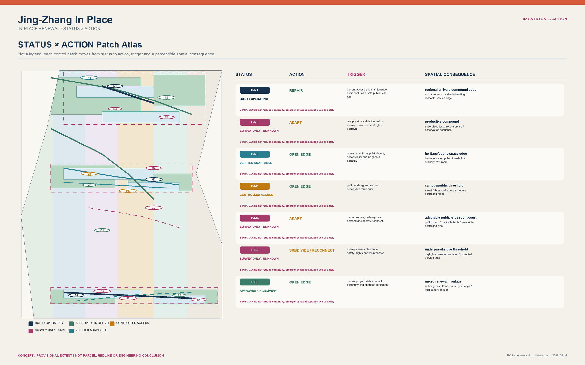
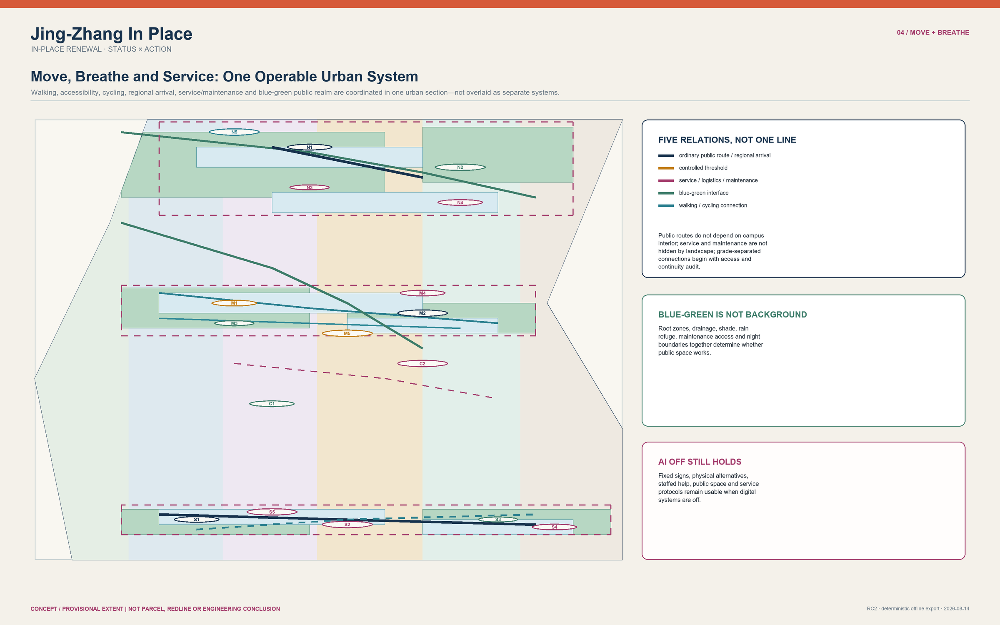
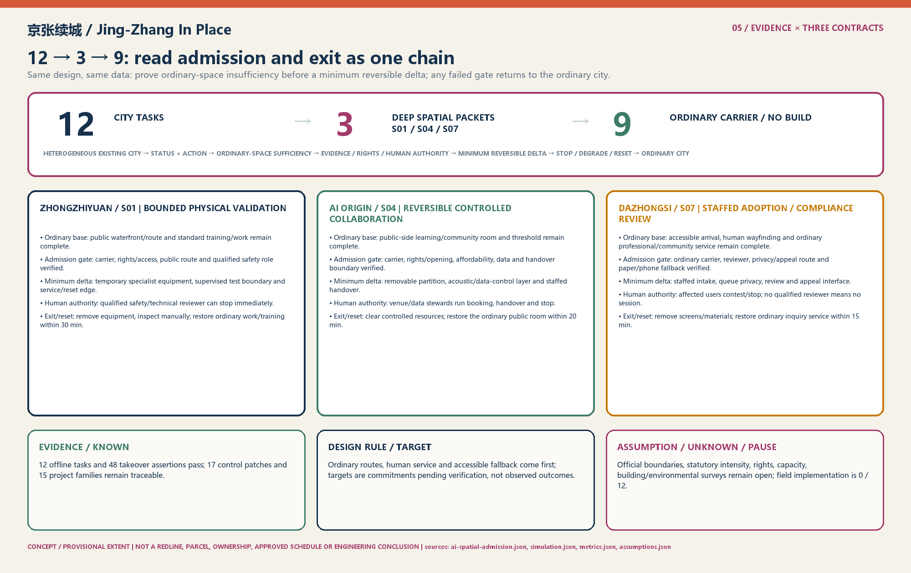

# Jing-Zhang In Place

> **Core Thesis**: Jing-Zhang is not a blank line waiting to be filled with AI, but an existing city with unequal statuses, jurisdictions, and cross-sections. The proposal employs `STATUS × ACTION` to establish the baseline spatial floor first, upholding `AI_OFF_CITY` (where ordinary public streets, mixed daily life, step-free routes, and human services operate 100% completely without AI intervention). Across 12 urban tasks, it strictly enforces the "ordinary-space sufficiency test," admitting only S01, S04, and S07—where physical testing, controlled collaboration, and compliance review are demonstrably insufficient in ordinary rooms—as deep spatial packets. The remaining 9 tasks are explicitly NO-BUILD or ordinary carriers. All admitted specialist spaces are equipped with strict Time-To-Live (TTL), absolute human authority, and immediate physical reset mechanisms. [data:visual/assets/ai-spatial-admission.json#admission_chain]

---

### Three Reading Paths: 60 Seconds, 5 Minutes, Deep Read

To accommodate reviewers with varying time budgets and focus areas, three self-contained reading paths are provided:

| Path | What to Read | Questions Answered |
| :--- | :--- | :--- |
| **60 Seconds** | Core Thesis ｜ Three Core Evidence Readings ｜ Five Core Figures with Reading Guides | What problem the proposal solves, what it delivers, and what it strictly avoids |
| **5 Minutes** | Three Scopes ｜ STATUS × ACTION Spatial Mending ｜ Three Key Area Typologies ｜ 12→3 Admission & 9 NO-BUILD Tasks ｜ A Citizen's Day | Spatial structure, jurisdictional boundaries, scenario deployment, and human lived experience |
| **Deep Read** | Full text reading ｜ Cross-audit against `simulation.json`, `metrics.json`, `compliance_matrix.json`, and `assumptions.json` | Field triggers, recalculation methods, and exit responsibilities for every spatial and institutional claim |

**Three Core Evidence Readings**:
1. **Offline State-Machine Rehearsal**: **12/12** tasks passed; Handover Assertions: **48/48** passed;
2. **Three Deep Delivery Contracts**: CONTRACT-S01 / CONTRACT-S04 / CONTRACT-S07 define explicit roles, T1–T3 operational triggers, and demountable fast-reset logistics;
3. **Field Engineering & Live Deployment**: **0/12**, strictly reserved for the field environment, contingent upon official data release, statutory redlines, and formal authorizations. [metric:deep_ai_task_packet_count]

---

## Historical Heritage & Spatial Precedents: Alignment, Crossing, and Handover

The Jing-Zhang Railway left not merely a physical alignment, but engineering wisdom for navigating complex urban constraints:
1. **Switchback Alignment (Trading Distance for Gradient)**: Jeme Tien Yow solved the steep mountain gradient at Qinglongqiao with a switchback ("人" shape). This proposal translates that into **"Trading Admission for Resilience"**—avoiding blanket corridor-wide AI deployment in favor of spatial graduation and reversible admission to handle technological uncertainty. [source:OFFICIAL-ANNOUNCEMENT]
2. **Level Crossing Stitching (Grade Crossings and Separation)**: Historic level crossings evolved into contemporary urban stitching seams such as Tsinghua East Road and Zhichun Road. This proposal insists on continuous surface pedestrian routes and independent step-free paths, preventing technological apparatus from severing daily civic life. [source:PARK-PHASE1]
3. **Handover Accountability (Dual-Confirmation Protocol)**: Railway handover protocols mandate that incoming and outgoing shifts verify status and unresolved items never disappear. This proposal establishes a complete `S0 Ordinary City → S1 Admitted Specialist State → S2 Reset/Exit` handover chain, ensuring every technological intervention has a designated signatory and an exit ticket. [source:AGENT-TASKBOOK]

---

## Design Basis and Source List

The open-call announcement, taskbook, allowed design space, standards, and source registry constitute the primary control inputs. Location-specific claims remain strictly limited to the spatial and temporal scope supported by each source; international precedents serve as methodological inspiration rather than evidence for a Jing-Zhang project, partnership, or site. [source:OFFICIAL-ANNOUNCEMENT] [source:AGENT-TASKBOOK] [source:SOURCE-REGISTRY] The provisional envelope and three key-area rectangles serve conceptual, topological, and communication purposes only; they must never be construed as statutory redlines, property parcels, ownership boundaries, or planning approvals. [source:BOUNDARY-SOURCE] [depth:existing_conditions_diagnosis]

> **How to Read This Figure (FIG.01 Site State and Three-Level Scope)**:
> 1. **Verify Three-Level Nesting**: Examine the nested relationship between the 43.6 km² coordination zone, the 11.4 km² overall design zone, and the three key areas;
> 2. **Identify Provisional Boundaries**: Note that provisional boundaries and survey-required constraint areas are rendered with dashed linework without asserting unverified official redlines;
> 3. **Confirm Evidence Traceability**: Review the underlying evidence tiers to ensure all spatial assertions are auditable and grounded.

---

## Three-Level Scope Framework

The 43.6 km² coordination scope addresses ecosystem, talent, and public-service synergy; the 11.4 km² overall scope organizes urban design through status, action, connectivity, and public space; the three key areas address distinct cross-sectional and operational challenges. The three tiers are not mere zoom levels of a single axis, but are governed by evidence granularity, jurisdictional responsibilities, and permissible actions. [source:OFFICIAL-ANNOUNCEMENT] [metric:site_area_sqm] [metric:key_area_count] This scope framework is verified through a traceable hierarchy. [depth:three_level_scope_framework] When official geometries are released, all geometries, metrics, drawings, and action interfaces must be recalculated synchronously. To prevent scale misinterpretations, the coordination tier states asset/interface relationships only, the overall tier states provisional topologies only, and the key-area tier states typological sections only.

---

## Coordinated Research Area: Industry and Future City Research

The coordinated scope identifies six asset categories: research/educational controlled perimeters, existing innovation carriers, enterprise–professional service interfaces, regional gateways, river/park heritage, and daily residential communities. These assets form a multi-entry ecosystem through public-side rooms, verified existing carriers, ordinary mixed blocks, and maintenance access, rather than assuming corporate relocations, campus mergers, or forced perimeter removals. [source:AI-ORIGIN] [source:QINGHE-HUB] [depth:overall_spatial_structure] Drawing from Seoul AI Hub, Vector, Mila, Singapore PlatformAI, and Digital Catapult, the proposal adopts mechanisms of responsibility, service, verification, and exit rather than replicating architectural forms. [source:BENCHMARK-SEOUL-AI-HUB] [source:BENCHMARK-DIGITAL-CATAPULT]

---

## Overall Design Area: Urban Renewal and Regulatory-Plan-Level Urban Design

The overall structure is organized via STATUS × ACTION: five existing conditions (BUILT_OPERATING, APPROVED_OR_IN_DELIVERY, CONTROLLED_ACCESS, SURVEY_ONLY_UNKNOWN, and VERIFIED_ADAPTABLE) map to five bounded actions (RETAIN, REPAIR, OPEN_EDGE, SUBDIVIDE_RECONNECT, and ADAPT_INFILL). Each patch records its source, constraints, users, triggers, cross-section, mobility, services, blue-green assets, responsibility, stop triggers, and exit routes; wholesale demolition and replacement is excluded from the default action catalog. [data:visual/assets/status-action-register.json#P-N1] [metric:status_action_patch_count] [depth:land_use_layout] Development intensity and height controls utilize street enclosure, ground-floor permeability, threshold depth, and service-edge rules, with statutory numerical limits pending official government release. [standard:MOHURD-CONTROL-DETAILED-PLANNING] [depth:development_intensity_controls] [depth:height_massing_character]

AI spatial admission is not a secondary urban spine: it is a bounded task evaluation within an already permitted action. Ordinary paths, ordinary rooms, maintenance, and human services take precedence; if ordinary space is sufficient, evidence or rights are inadequate, or qualified human authority is absent, the outcome is an ordinary carrier, removable general-purpose kit, or NO BUILD, rather than reserved construction for AI. [data:visual/assets/ai-spatial-admission.json#city_framework]

> **How to Read This Figure (FIG.02 Land Use, Action Patches, and Urban Stitching)**:
> 1. **Review 5×5 Status-Action Matrix**: Confirm the baseline status and restricted action assigned to each of the 17 patches, rejecting indiscriminate tabula-rasa redevelopment;
> 2. **Check Public Continuity**: Verify that green open space and mixed service interfaces remain uninterrupted without technology trials blocking daily access;
> 3. **Verify Topological Integrity**: Check that conceptual land use forms a complete partition with zero overlaps and zero gaps, mathematically derived in EPSG:4548.

| Status | Action Determination | Non-Negotiable Boundary |
| :--- | :--- | :--- |
| **BUILT_OPERATING** | Retain or repair proven defects | Do not extrapolate open status to adjacent unverified carriers |
| **APPROVED_OR_IN_DELIVERY** | Coordinate interfaces first, mend gaps second | Do not mislabel in-progress delivery as fully open access |
| **CONTROLLED_ACCESS** | Public side first; separate visitor from project access | Do not rely on campus internal roads for public through-movement |
| **SURVEY_ONLY_UNKNOWN** | Survey only, reversible testing, or NO BUILD | Do not diagnose property rights, structural health, or utility capacity |
| **VERIFIED_ADAPTABLE** | Adapt only after professional and rights gates pass | Do not treat typological prototypes as definitive building diagnoses |

---

## Detailed Design of Key Areas

Zhongzhiyuan is framed as a water–compound–regional arrival mosaic: restricting physical validation to verified carriers, while segregating public riverfront parkland, service resets, and controlled testing. AI Origin serves as a public-side campus threshold: ensuring permanent city routes do not traverse campus interiors, establishing ordinary learning/community rooms first, and switching to a temporary specialist state only during authorized sessions. Dazhongsi is structured as a multi-level station-city renewal field: focusing on four-direction accessibility, surface continuity, cycling, loading, and daily commerce, without treating provisional rectangles as final station exits or parcel plans. [source:QINGHE-HUB] [source:CAMPUS-ACCESS] [source:GRADE-SEPARATION] These three key areas satisfy detailed urban design depth. [depth:three_key_area_detailed_design] No single architectural courtyard, lobby, or AI room typology may be duplicated across the three sites.

All three interfaces follow a scale-free typology of `S0 Ordinary City → S1 Admitted Specialist State → S2 Exit/Reset`, asserting no property parcel, engineering dimension, station portal, or statutory control. Zhongzhiyuan ensures public waterfront pathways remain uninterrupted, confining validation within carriers and restoring maintenance and ordinary training upon equipment removal; AI Origin maintains public thresholds and ordinary rooms, utilizing demountable acoustic partitions and human sign-offs during authorized collaborations, fully restoring general use upon clearing; Dazhongsi guarantees independent step-free arrival and staffed services, re-purposing staffed compliance review spaces for general civic services upon session close. [data:visual/assets/ai-spatial-admission.json#interfaces]

> **How to Read This Figure (FIG.03 Three Key Areas and Differentiated Cross-Sections)**:
> 1. **Compare Three Differentiated Sections**: Observe the distinct cross-sectional logics across the northern water-arrival mosaic, middle campus threshold, and southern grade-separated hub;
> 2. **Audit S0–S1–S2 Cycle**: Trace each key area from ordinary city (S0) to admitted specialist state (S1) to complete physical reset (S2);
> 3. **Confirm Typological Nature**: Recognize drawings as scale-free typological prototypes rather than fabricated construction blueprints.

---

## AI Innovation Ecosystem, Personas, and AI+ Scenarios

Under `AI_OFF_CITY`, public routes, mixed urban vitality, blue-green systems, ordinary rooms, human services, and maintenance remain fully operational. AI interventions must pass the planning chain: "Ordinary City → Ordinary-Space Sufficiency Test → Special Spatial Condition Necessary? → Evidence/Rights/Human Authority Gate → Minimum Reversible Spatial Delta → TTL/Stop/Degrade → Exit/Reset → Ordinary City." AI does not replace `STATUS × ACTION`, nor does it automatically justify spatial expansion. [data:visual/assets/ai-spatial-admission.json#admission_chain]

The 12 tasks do not represent 12 construction projects: S01, S04, and S07 are the sole deep spatial packets; the remaining 9 tasks retain ordinary carriers, human services, physical alternatives, or NO BUILD. Every entry preserves human authority, TTL, stop triggers, and reset protocols. [data:visual/assets/ai-spatial-admission.json#tasks] [metric:deep_ai_task_packet_count]

| Task ID & Name | Ordinary Baseline & Sufficiency Test | Spatial Decision | Human Authority & TTL | Stop Trigger & Physical Reset |
| :--- | :--- | :--- | :--- | :--- |
| **S01 Physical Validation** | Code/simulation use ordinary rooms; supervised physical validation insufficient | **Deep**: Controlled testing, observation, reset edge | Qualified operator/reviewer; Session | Stale authorization, hazard, or route conflict; remove kit, restore ordinary training/work |
| **S02 Environmental Robustness** | Non-physical testing is sufficient | **NO BUILD**; verified carrier time-window only | Human responsibility; Test window | Unverified carrier or public harm; retract boundary, restore carrier |
| **S03 Human Safety Review** | Ordinary meeting room is sufficient | **NO BUILD**; general peer review | Human reviewer; Evidence version | Stale evidence; archive/delete authorization, ordinary room |
| **S04 Controlled Collaboration** | General learning/teamwork is sufficient; authorized controlled collaboration insufficient | **Deep**: Demountable partition, acoustic/data boundary | Qualified role; Booking session | Route or openness compromised; clear resources, restore ordinary room |
| **S05 Open Learning** | General learning/community rooms are sufficient | **NO BUILD**; removable teaching kit | Human facilitator; Event | Absent host or accessibility failure; ordinary room |
| **S06 Community Service** | Human desks and ordinary rooms are sufficient | **NO BUILD**; standard service point | Human staff; Service cycle | Bias, exclusion, or walk-in service loss; standard service point |
| **S07 Adoption/Compliance Review** | General referral is sufficient; staffed privacy review insufficient | **Deep**: Sightlines, privacy queue, controlled review bay | Qualified reviewer; Evidence/policy version | Stale evidence or absent reviewer; general professional/community service |
| **S08 Step-Free Wayfinding Aid** | Static signage and human help are sufficient | **NO BUILD**; physical alternative path priority | Human responsibility; Facility status | Unverified path; standard physical wayfinding continues |
| **S09 Post-Rain Maintenance Audit** | Manual inspection and work orders are sufficient | **NO BUILD**; maintenance access / temporary closure | Maintenance lead; Inspection state | Absent on-site confirmation; remove closure after inspection |
| **S10 Accessibility Status Relay** | Human/static alternative routes are sufficient | **NO BUILD**; decision-point cue + physical alternative | Human confirmation; Short status window | Stale data; standard physical signage persists |
| **S11 Quiet Boundary for Events** | Human stewarding is sufficient | **NO BUILD**; removable queue / quiet boundary | Human event lead; Event duration | Noise/light/accessibility threshold breach; dismantle event kit |
| **S12 Evidence Status Audit** | Professional planning review is sufficient | **NO BUILD**; modifies future labels only | Professional human decision; Source version | Missing source/audit; maintain original status, no automatic build |

12 scenario cards, 3 industry validations, and 8 personas cover daytime, nighttime, weekends, weather extremes, and digital/physical failures. [metric:ai_scenario_count] [metric:industry_validation_scenario_count] [metric:persona_count] Municipal and infrastructure capacities require professional verification. [depth:municipal_new_infrastructure]

---

## Implementation Feasibility, Role Authorities, and Physical Reset

Rather than presenting all 15 renewal projects as ungrounded construction promises, precise D0–D100 concept delivery contracts are established for the three admitted deep spatial packets (S01, S04, S07). Each contract defines three key role profiles, three-tier operational triggers, and fast-reset logistics: [data:visual/assets/ai-spatial-admission.json#delivery_contracts]

### 1. Role Profiles & Authority Ledger
- **Site Operator**: Manages facility scheduling, daily cleaning, and general maintenance; holds no authority to reject human takeover or unilaterally extend admission windows.
- **Independent Compliance Reviewer**: Independent from development teams; verifies evidence versions and privacy compliance prior to sessions; holds unilateral veto authority to terminate specialist states upon anomalies.
- **Human Safety Monitor**: Equipped with a physical Emergency Stop (E-Stop); immediately initiates manual override and spatial reset upon visual obstruction, excessive noise, accessibility conflict, or unauthorized access.

### 2. Quantitative Operational Triggers (T1–T3)
- **Trigger T1 (Boundary Breach)**: Physical testing envelope, acoustic threshold (>65dB), or sightline boundaries breached; system triggers audiovisual alert and cuts power to testing apparatus within 60 seconds.
- **Trigger T2 (Unstaffed Failure)**: Human reviewer or safety monitor absent for >5 minutes without qualified replacement; system automatically locks specialist gear and restores public access.
- **Trigger T3 (Authorization Expiry)**: Session TTL expires or referenced regulatory version is deprecated; local temporary caches clear, and space must be restored within 30 minutes.

### 3. Demountable Reversible Logistics
All deep spatial packets permit only prefabricated lightweight partitions, acoustic curtains, and modular Plug-and-Play MEP connectors. Structural modifications to load-bearing elements or primary utility networks are prohibited. Spatial resets are executed by facility staff under standard operating procedures (SOP) within 30 minutes, fully restoring general civic and community functions.

| Delivery Contract | D0–D30 Preparation | D31–D60 Setup & Testing | D61–D100 Operation & Handover | Fast Reset & Fallback |
| :--- | :--- | :--- | :--- | :--- |
| **CONTRACT-S01 Zhongzhiyuan** | Insufficiency dossier, carrier tenure, safety role audit | Observation gallery, removable test envelope, plug-in power | Bounded testing; monitor path safety and emergency stop | 30-min kit removal, restore standard workstations/training |
| **CONTRACT-S04 AI Origin** | Public-side carrier, opening hours, data boundary approval | Modular acoustic partitions, dedicated visitor access | Authorized booking; verify zero public-route encroachment | 20-min partition retraction, restore open community space |
| **CONTRACT-S07 Dazhongsi** | Standard desk baseline, privacy routing, paper fallback | Privacy screen, staffed appeal/review station | Staffed review sessions; rehearse paper referral and contest | 15-min screen removal, restore standard inquiry desks |

---

## Public Interest Floor & A Citizen's Day

The proposal measures planning success primarily through accessibility for vulnerable groups and everyday citizens. The public-rights floor remains uncompromised:
- No technology trial may encroach upon continuous, level step-free pedestrian corridors;
- Every intelligent service must maintain staffed desks, paper guides, and telephone hotlines;
- Any affected citizen holds the statutory right to halt autonomous processes and demand human review. [data:visual/assets/ai-spatial-admission.json#public_rights_floor]

### A Citizen's Day: Morning Routine of 72-Year-Old Resident P4

> **08:15 Dazhongsi Residential Quarter**: 72-year-old Mrs. Li (with mild hearing impairment and no smartphone) steps out for morning groceries. She walks along continuous, level step-free ramps and clear physical wayfinding signage, requiring zero QR scans or facial recognition.  
> **08:45 Community Service Center (S07 Node)**: Mrs. Li inquires about medical insurance reimbursement. The center maintains a brightly lit, staffed counter where a community worker assists face-to-face; even if the AI copilot undergoes maintenance or goes offline, paper guides and human workflows proceed without interruption.  
> **09:30 Tsinghuayuan Heritage Park (near S04)**: Mrs. Li rests on a shaded park bench. The adjacent AI collaboration workshop is fully enclosed within internal lightweight partitions, leaving the park's tree-lined avenues, benches, and open lawns completely unencumbered by sensors or private enclosures.

---

## Land Use, Building Scale, and Retain-Renovate-Demolish Strategy

Land use categories conceptually cover green open space, retained adaptive space, public learning, mixed services, slow-mobility services, and conditional reserves, without asserting statutory zonings or parcel adjustments. Building massing layers represent typological concept carriers rather than structural diagnoses. The action sequence prioritizes retaining working systems, repairing proven deficits, opening edges, subdividing/reconnecting, and adapting/infilling; individual building replacement requires independent structural, fire, heritage, ownership, and public-interest proof. [standard:MNR-LAND-USE-CLASSIFICATION-GUIDE] [data:geometry/land_use.geojson#LU-01] [data:geometry/buildings.geojson#BLDG-N1] [depth:retain_renovate_demolish]

---

## Transport, Rail, Municipal Infrastructure, and Public Services

Transportation systems segregate regional rail arrivals, standard public streets, pedestrian/step-free routes, cycling, parking/drop-off, loading, maintenance, emergency access, and institutional thresholds. Every conceptual connection is classified as VERIFIED_EXISTING, CONTEXTUAL, CONCEPTUAL, or SURVEY_REQUIRED; no bridge, underpass, redline, or capacity is portrayed as an approved project. [data:geometry/roads.geojson#ROAD-01] [source:LINE12-OPEN] [depth:traffic_rail_slow_parking] Utilities (power, telecom, compute, water/drainage, waste, fire) follow the "Known–Unknown–Rules–Future Verification" sequence, utilizing qualified existing resources first and expanding only upon verified demand. [metric:utility_capacity] [depth:municipal_new_infrastructure]

> **How to Read This Figure (FIG.04 Mobility, Services, and Blue-Green Network)**:
> 1. **Verify Slow-Mobility Independence**: Confirm that continuous step-free and cycling networks are decoupled from controlled campus perimeters;
> 2. **Check Connection Statuses**: Review the explicit classification of connections into verified existing, contextual, and survey-required;
> 3. **Audit Ecological Safeguards**: Confirm that green corridors incorporate soil depth, root zone, and stormwater capacity verifications.

---

## Blue-Green Network, Public Space, and Urban Character

The Heritage Park, Qinghe River, Xiaoyue River, ordinary streets, courtyard forecourts, campus public edges, and station plazas represent distinct landscape typologies. Each design intervention undergoes checks for soil depth, root zones, drainage, shade, maintenance, seasonal shifts, night lighting, and accessibility; green and public space ratios are geometry-derived consistency figures rather than statutory metrics. [source:PARK-PHASE1] [source:WATER-PROJECTS] [metric:green_ratio] [metric:public_space_ratio] [depth:blue_green_public_space] Prior to execution, every green patch requires tree/soil/drainage surveys; any conflict triggers the removal of temporary installations and restoration of baseline maintenance conditions.

---

## Renewal Projects, Implementation Policy, and Phasing

15 project families originate from G0 evidence/interface registration and accessibility audits. G1 implements low-regret repairs and single-consent reversible trials; G2 undertakes adaptive retrofits following independent professional review; G3 performs conditional infill upon official controls and proven capacity deficits; G4 maintains operations and iterative evidence updates. Every project defines primary evidence, dependencies, beneficiaries, AI/NO-AI modes, KPIs, stop conditions, and responsible roles. [data:visual/assets/renewal-project-portfolio.json#PRJ-01] [metric:renewal_project_family_count] [depth:renewal_project_list] [depth:phasing_implementation]

| Phase | Core Evidence Gate | Permissible Actions & Scope | Exit & Reset Conditions |
| :--- | :--- | :--- | :--- |
| **G0 Preparation** | Sources, status, tenure, access, and capacity baseline survey | Evidence alignment, interface audit, asset registry | Missing data or rights conflicts halt progression |
| **G1 Inception** | Written stakeholder consent, step-free alternative proof | Low-regret physical repairs and reversible micro-trials | Public obstruction or resident complaints trigger removal |
| **G2 Deepening** | Structural safety, fire compliance, heritage protection review | Selective interior adaptation of existing buildings | Failure of professional review stops work |
| **G3 Completion** | Official redlines available, capacity deficit proven, public audit | Conditional stitching and essential civic infill | Absence of statutory baseline prohibits new permanent builds |
| **G4 Operation** | Maintenance logs, public feedback, continuous evidence versioning | Long-term stewardship, periodic audits, and rule updates | Depleted maintenance funds or service gaps trigger shutdown |

---

## Metrics, Area Recalculation, and Compliance Matrix

All computable areas and lengths are derived deterministically from GeoJSON layers in EPSG:4548: provisional site, concept land use, building footprints, green/public spaces, and concept connections are designated as GEOMETRY_DERIVED. Statutory FAR, height limits, and utility capacities are designated as UNKNOWN, refusing to substitute graphic precision for evidence. [metric:concept_land_use_area_sqm] [metric:green_space_area_sqm] [metric:public_space_area_sqm] Concept connection length is a separate non-engineering indicator. [metric:concept_road_length_m] Recalculation rules are fixed in the design depth index. [depth:metrics_recalculation] Three matrices link all tasks, standards, and depth items to specific prose, layers, metrics, drawings, sources, assumptions, and review gates.

> **How to Read This Figure (FIG.05 Metrics, Evidence, and Phase Gates)**:
> 1. **Check 12/12 State Machine Pass**: Confirm that 12 offline tasks and 48 takeover assertions pass completely;
> 2. **Review Known/Unknown Demarcation**: Confirm that statutory FAR and height limits are honestly logged as UNKNOWN;
> 3. **Verify Four Review Gates**: Confirm that DETERMINISTIC, SPATIAL, VISUAL, and PROFESSIONAL gates all achieve PASS status.

---

## Risk, Copyright, and Compliance

Risk control does not relabel unknowns as complete. It converts every unknown into a survey, recalculation, consent, professional review, stop trigger, or exit condition. Official boundaries, southern geometric offsets, building tenure, curb management, utility capacities, environmental surveys, campus schedules, and AI carriers remain active constraints even when tools return PASS. [data:geometry/constraints.geojson] [depth:risk_missing_data] [standard:PROJECT-AGENT-OPEN-CALL-TASKBOOK] Figures are deterministically generated locally without commercial map tiles, remote fonts, CDNs, private data, or uncleared media. This submission represents conceptual urban design recommendations; final determinations rest with human authorities and qualified professionals.

---

## References

The complete source index records publishers, URLs, dates, authorities, supported claims, and unsupported boundaries; the assumptions index tracks impacts and closure paths. Public sources support only their declared spatial/temporal scales, and international precedents remain background methods. The Owner selected "Jing-Zhang In Place" as the participant's final submission candidate. This internal selection does not represent a competition result, award claim, official adoption, implementation approval, or government endorsement. [source:SOURCE-REGISTRY] [source:BENCHMARK-VECTOR] [source:BENCHMARK-MILA] PlatformAI is background methodology only, never a local service commitment. [source:BENCHMARK-AI-SINGAPORE]
