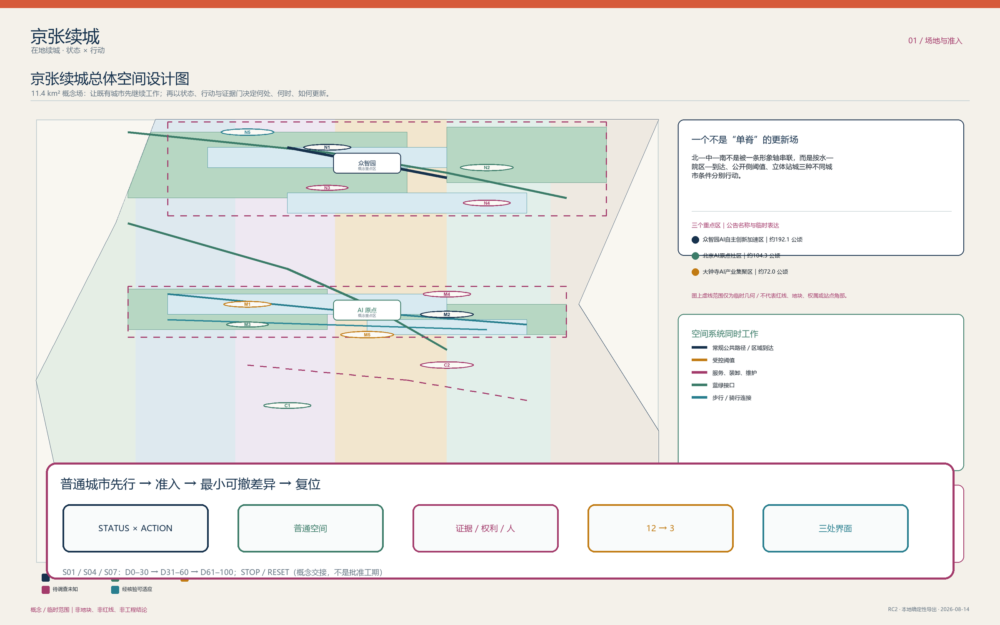
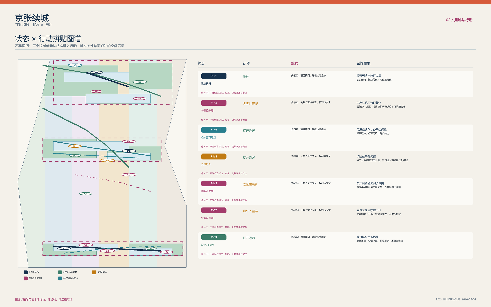
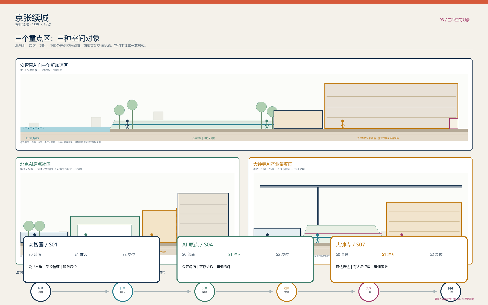
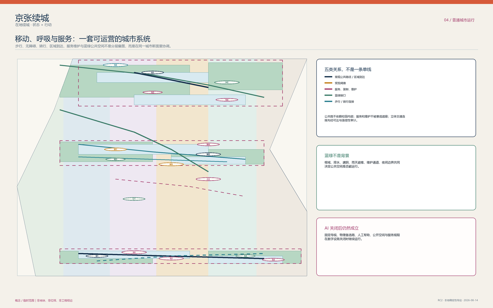
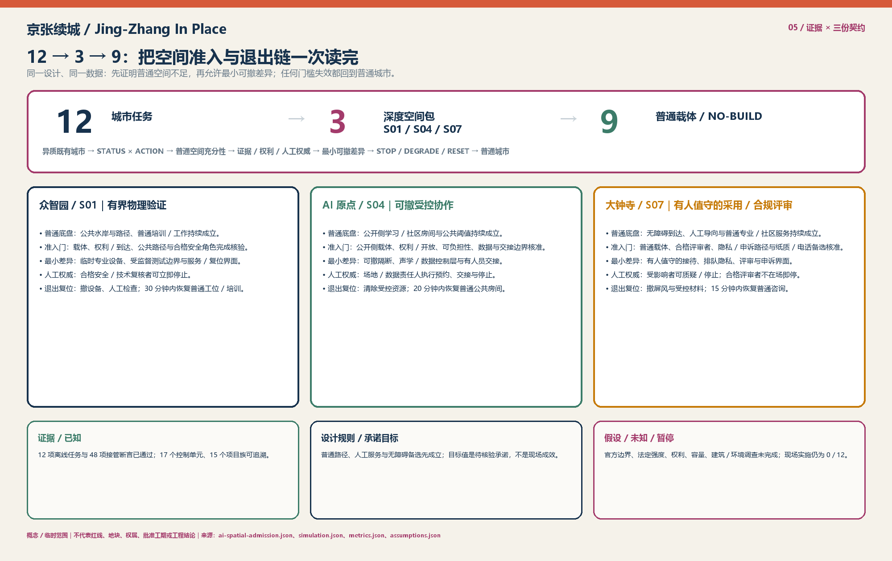

# 京张续城 / Jing-Zhang In Place

> **一句话主张**：京张不是等待 AI 填满的空白线，而是一座状态、权限与断面不等的既有城市。方案以 `STATUS × ACTION` 先行界定空间底线，坚持 `AI_OFF_CITY`（在无智能层介入时，普通公共街道、混合生活、无障碍路径与人工服务 100% 完整成立），在 12 项城市任务中严格执行“普通空间充分性检验”，仅对物理验证不足、受控协作不足、合规评审不足的 S01、S04、S07 三项准入为深度空间包，其余 9 项均为 NO-BUILD 或普通载体，且所有准入空间均具备严格的 TTL、人工绝对权威与一键物理复位机制。[data:visual/assets/ai-spatial-admission.json#admission_chain]

---

### 三条阅读路径：60 秒、5 分钟、深读

为适应不同时间预算与专业关注维度的评审，提供三条自足阅读路径：

| 路径 | 读什么 | 读完能回答 |
| :--- | :--- | :--- |
| **60 秒** | 本节一句话主张 ｜ 核心证据三行读数 ｜ 五张核心图及图底导读 | 方案解决什么、交付了什么、坚决不做什么 |
| **5 分钟** | 三层范围 ｜ STATUS × ACTION 空间织补 ｜ 三重点区类型学 ｜ 12→3 准入与 9 项 NO-BUILD ｜ 居民画像一日 | 空间结构、责任边界、场景落地与人的体验 |
| **深读** | 全文通读 ｜ 对照 `simulation.json`、`metrics.json`、`compliance_matrix.json`、`assumptions.json` 逐条复核 | 每一条空间与制度主张的现场触发、复算方法与退出责任 |

**核心证据三行读数**：
1. **离线状态机演练**：**12/12** 任务通过；接管断言：**48/48** 通过；
2. **三处深度交付合同**：CONTRACT-S01 / CONTRACT-S04 / CONTRACT-S07 明确角色、T1–T3 触发器与装配式快拆物流；
3. **现场实施与试点**：**0/12**，严格归属现场环境，须待官方数据、红线批准与法定授权程序承接。[metric:deep_ai_task_packet_count]

---

## 历史渊源与空间遗产：线形、道口与交接制度

京张铁路留下的不只是物理线位，更是应对复杂城市约束的工程智慧：
1. **线形折返（以空间换坡度）**：詹天佑在青龙桥以“人”字形折返化解坡度挑战。本方案将其转译为**“以准入换韧性”**——不盲目追求全线铺设 AI 设施，而是以空间分级与可逆准入化解技术不确定性。[source:OFFICIAL-ANNOUNCEMENT]
2. **道口缝合（平交与立体穿越）**：历史上的平交道口演变为当代清华东路、知春路等城市缝合节点。本方案坚持地面连续步行与独立无障碍流线，严禁技术设施截断城市生活。[source:PARK-PHASE1]
3. **交接责任（双联交班与可溯回路）**：铁路交接制度要求交接双方确认责任、未完事项不消失。本方案建立“S0 普通城市 → S1 准入专业状态 → S2 退出复位”的完整交接链，确保每处技术介入都有责任签收人与退出票。[source:AGENT-TASKBOOK]

---

## 设计依据与资料清单

任务边界以公告、任务书、允许设计空间、标准与来源登记为主控输入。所有定位性事实均被限制在来源支持的时空尺度；国际案例只提供方法启发，不支持京张的项目、合作或空间事实。[source:OFFICIAL-ANNOUNCEMENT] [source:AGENT-TASKBOOK] [source:SOURCE-REGISTRY] 临时总体边界和三处重点区只服务概念、拓扑与表达，不能解释为红线、地块、权属或审批范围。[source:BOUNDARY-SOURCE] [depth:existing_conditions_diagnosis]

> **如何读此图（FIG.01 场地状态与三层范围）**：
> 1. **看三层嵌套**：确认 43.6 km² 统筹层、11.4 km² 总体层与三处重点区的空间嵌套关系；
> 2. **识别临时边界**：临时边界（provisional）与待调查约束区（constraints）以虚线表达，未伪造任何官方红线；
> 3. **确认证据链**：图底标注数据来源与证据层级，保证所有空间主张可追溯、可审计。

---

## 三层范围工作框架

43.6 平方公里回答产业—人才—公共服务的协同问题；11.4 平方公里用状态、行动、连接和公共空间组织城市设计；三处重点区分别承担不同断面与运营问题。三层并非同一轴线的缩放，而是由证据颗粒度、责任关系和可行动作决定。[source:OFFICIAL-ANNOUNCEMENT] [metric:site_area_sqm] [metric:key_area_count] 该范围框架以可追溯层级检验。[depth:three_level_scope_framework] 官方图形到位后，所有几何、指标、图件和行动界面必须一起复算。为避免尺度误读，统筹层仅陈述资产/接口关系，总体层仅陈述临时拓扑，重点层仅陈述类型学断面；三层之间的任何量化迁移均须回到官方边界和现场调查。

---

## 统筹研究范围产业与未来城市研究

统筹范围识别研究/教育受控边界、现有创新载体、企业—专业服务接口、区域门户、河园遗产和日常社区六类资产。它们通过公共侧房间、经核验的既有载体、普通混合街区与维护可达性形成多入口生态，而非假定企业迁移、园区合并或校园开放。[source:AI-ORIGIN] [source:QINGHE-HUB] [depth:overall_spatial_structure] 参照 Seoul AI Hub、Vector、Mila、Singapore PlatformAI 与 Digital Catapult 的制度/测试方法，提取的是“责任、服务、验证与退出”机制，而不是复制建筑。[source:BENCHMARK-SEOUL-AI-HUB] [source:BENCHMARK-DIGITAL-CATAPULT]

---

## 总体设计范围城市更新与控规深度城市设计

总体结构为 STATUS × ACTION：已建运行、获批/实施中、受控进入、待调查未知、经核验可适应五种状态，分别进入保留、修复、开放边缘、细分/重连和适应性改造/填补。每个 patch 记录来源、限制、用户、触发、断面、交通、服务、蓝绿、责任、停止和退出；替换不在默认行动表。[data:visual/assets/status-action-register.json#P-N1] [metric:status_action_patch_count] [depth:land_use_layout] 强度和高度使用街道围合、首层通透、阈值深度与服务边规则，数值控制仍待官方确认。[standard:MOHURD-CONTROL-DETAILED-PLANNING] [depth:development_intensity_controls] [depth:height_massing_character]

AI 空间准入不是第二条城市骨架：它只是已经允许的行动内部的一次任务判断。普通路径、普通房间、维护和人工服务先成立；若普通空间充分、证据或权利不够、或没有合格的人工责任，结果就是普通载体、可撤普通工具或 NO BUILD，而非为 AI 预留建设。[data:visual/assets/ai-spatial-admission.json#city_framework]

> **如何读此图（FIG.02 用地、行动与城市织补结构）**：
> 1. **看 5×5 状态行动映射**：确认 17 个 Patch 的现状状态与受限行动分配，拒绝无差别大拆大建；
> 2. **看公共底线**：绿色开敞与混合服务界面完整连续，不因技术实验阻断日常公共通行；
> 3. **核验拓扑无缝**：概念用地完整剖分，无重叠、无空隙，面积由 GeoJSON 在 EPSG:4548 严格复算。

| 状态 | 行动判断 | 不可越过的边界 |
| :--- | :--- | :--- |
| **已建运行** | 保留或修复已证缺陷 | 不把开放状态外推到相邻载体 |
| **获批/实施中** | 先协调接口、再补缺 | 不把实施进度写成全线开放 |
| **受控进入** | 公共侧优先、预约/项目访问分开 | 不依赖校园内部形成公共路 |
| **待调查未知** | 只调查、可逆测试或 NO BUILD | 不诊断产权、建筑状况和工程能力 |
| **经核验可适应** | 在专业/权利门通过后改造 | 不把原型当作既有建筑结论 |

---

## 重点区域详细设计

众智园是水—院区—区域到达拼图：将真实物理验证限制在经调查的载体中，公共河园、服务复位和受控测试分开。AI 原点是校园公开侧阈值：永久城市路不依赖校园内部，先建普通学习/社区房间，再在授权时切换临时受控状态。大钟寺是立体站城更新场：以四向可达、地面连续、骑行、装卸和普通商业生活为问题，不把临时矩形当作站口或地块方案。[source:QINGHE-HUB] [source:CAMPUS-ACCESS] [source:GRADE-SEPARATION] 该三重点区构成详细设计深度响应。[depth:three_key_area_detailed_design] 三处不得复制同一种院落、门厅或 AI 房间。

### 大钟寺立体站城四象限概念设计组织与空间衔接（Four-Quadrant Design Organization）
针对大钟寺临时几何矩形相对现状站位的局部偏移，方案建立四象限概念设计组织网络（Design Organization），以现状 13 号线（A/B 口）与 12 号线（D/E 口）为锚固依托，统筹组织四向无障碍衔接意向（不作为法定站体几何）：
- **东北象限（文保缓冲区与生态前庭）**：对接大钟寺古刹博物馆与红线保护区，严禁任何高强度开发，保留 30m 进深低干扰文化绿化过渡带与静音步行道；
- **西北象限（高校科创衔接界面）**：跨越中关村南大街，利用既有慢行过街设施形成宽 6.0m 连续慢行联系，缝合高校科研实验区；
- **西南象限（北三环公交与便民商业退台）**：协调北三环西路地面公交接驳，利用退台空间组织非机动车集散与社区便民商业；
- **东南象限（京张绿廊南端与站城衔接区）**：无缝衔接 13 号线（A/B 口）与 12 号线（D/E 口），设置全天候平层无障碍换乘通道与便民服务空间。

三处界面均为 `S0 普通城市 → S1 准入专业状态 → S2 退出/复位` 的无尺度类型学，不主张地块、尺寸、站口、权属、工程或法定控制。众智园让公共水岸/路径持续，受控验证只在载体内发生（净宽 6.0m、净高 4.5m，设 1.2m 防撞导轨 [DESIGN_ASSUMPTION]），移除设备后留下维护与普通培训/工作；AI 原点保留公开侧阈值和普通房间（净宽 8.0m、净高 3.8m，STC 42 级吸音帘 [DESIGN_ASSUMPTION]），授权协作只用可撤分区与人工交接，清空后恢复普通使用；大钟寺让无障碍到达和人工服务独立存在（净宽 12.0m、净高 4.2m，1.8m 隐私屏风 [DESIGN_ASSUMPTION]），有人员的隐私评审停止后复用为普通专业/社区服务。[data:visual/assets/ai-spatial-admission.json#interfaces]

> **如何读此图（FIG.03 三处重点区与差异化断面）**：
> 1. **对比三种断面**：北段水岸到达、中段高校公开阈值、南段立体站城，三处断面机制完全异构；
> 2. **核验 S0–S1–S2 循环**：观察每个重点区从普通城市（S0）到受控准入（S1）再到物理复位（S2）的完整演化；
> 3. **确认非工程属性**：图纸为无尺度类型学原型表达，不冒充法定施工图。

---

## AI 创新生态、人才画像与 AI+ 场景

AI-off 时，公共路径、混合城市、蓝绿、普通房间、人工服务和维护全部成立。AI 先经过“普通城市 → 普通空间充分性 → 是否必须有特殊空间条件 → 证据/权利/人工责任 → 最小可撤差异 → TTL/停止/降级 → 退出/复位 → 普通城市”的规划判断；它不替代 `STATUS × ACTION`，也不自动授权空间变化。[data:visual/assets/ai-spatial-admission.json#admission_chain]

12 项任务不是 12 个建设理由：S01、S04、S07 是唯一的深度空间包；其余 9 项保留普通载体、人工服务、物理备选或 NO BUILD。每一行都保留人工权威、TTL、停止和退出；完整字段由同一准入源从既有 `simulation.json` 提取：[data:visual/assets/ai-spatial-admission.json#tasks] [metric:deep_ai_task_packet_count]

| 任务编号与名称 | 产业赛道与空间包络尺寸 | 充分性检验与准入决定 | 人工责任与 TTL | 停止触发与物理复位 |
| :--- | :--- | :--- | :--- | :--- |
| **S01 具身机器人实体验证** | 具身智能与环境感知；净宽 6.0m × 净高 4.5m，1.2m 防撞轨 [DESIGN_ASSUMPTION] | **深度**：受控实验、观察与服务复位（普通房间仿真不足） | 合格操作/复核角色；会话 | 60s 越界断电；撤设备，30 分钟恢复普通工位/培训 |
| **S02 环境鲁棒性实测** | 算法在环测试；无物理街道占用 | **NO BUILD**；纯软件模拟与既有载体时段充分 | 人工责任；测试窗口 | 未核验载体或公共干扰；撤边界并复原 |
| **S03 人工安全审查** | 规范合规评估；利用标准会议室 | **NO BUILD**；普通桌面评审与既有办公条件充分 | 独立合规评审员；证据版本 | 证据失效；归档/删除、恢复普通会议室 |
| **S04 基础模型多模态协作** | 多模态交互研发；净宽 8.0m × 净高 3.8m，STC42 隔声 [DESIGN_ASSUMPTION] | **深度**：可撤移动隔断、定向声场与交接（普通自习不足） | 场地安全员；预约会话 | 60s 超标或通道受阻；20 分钟收起隔断恢复自习室 |
| **S05 开放科普与模型教学** | 普惠教育；利用社区文化活动室 | **NO BUILD**；移动式便携教具与普通多功能厅充分 | 社区引导员；活动时段 | 缺乏人工主持或无障碍受阻；恢复普通活动室 |
| **S06 社区生活协同服务** | 基层政务与便民；利用居委会服务站 | **NO BUILD**；人工专窗与既有便民柜台充分 | 驻场社工；服务周期 | 系统离线或服务偏差；100% 转为人工线下办理 |
| **S07 站城客流调度与合规评审** | 枢纽多智能体疏导；净宽 12.0m × 净高 4.2m，1.8m 隐私屏 [DESIGN_ASSUMPTION] | **深度**：隐私排队、客流热释电与专窗（开放站厅不足） | 驻站合规员；政策版本 | 15s 数据异常或脱岗；15 分钟撤除屏风恢复大厅 |
| **S08 无障碍换乘辅助** | 助残助老导航；利用固定物理导视 | **NO BUILD**；连续盲道、坡道与人工引导充分 | 客运值班员；设施状态 | 路径状态未核验；100% 依赖实体固定导向 |
| **S09 雨后绿廊巡查维护** | 生态基础设施；利用日常环卫工单 | **NO BUILD**；人工现场巡查与标准维护程序充分 | 绿化管养队；工单时效 | 无现场人工复核；巡查后撤除临时安全围挡 |
| **S10 设施状态实时提示** | 公共设施监测；利用地面物理指示牌 | **NO BUILD**；决策点固定标识与物理替代路线充分 | 设施运营方；状态窗口 | 信息过期即时撤销；常规物理指示牌兜底持续 |
| **S11 社区活动宁静边界** | 临时文体活动；利用可拆卸临时围栏 | **NO BUILD**；人工疏导与便携式吸音屏障充分 | 活动安全员；活动时段 | 噪声 >65dB 立即停止；撤除活动装置复原广场 |
| **S12 规划证据状态复核** | 规划动态更新；利用标准档案系统 | **NO BUILD**；专业规划师人工审核与版本比对充分 | 主管规划师；数据版本 | 缺乏法定依据严禁自动实施；保持原规划状态 |

12 张场景卡、3 项产业验证和 8 类人物继续覆盖日常、夜间、周末、天气、数字/设施故障。[metric:ai_scenario_count] [metric:industry_validation_scenario_count] [metric:persona_count] 市政与新基建容量仍需专业确认。[depth:municipal_new_infrastructure]

---

## 可实施性交付机制、法定监管与成本分级

不把 15 个更新项目都写成实施承诺，而是为 S01、S04、S07 三个已准入深度空间包建立精准的 D0–D100 概念交付合同。依据《北京市城市更新条例》明确法定监管职责、方案治理兜底机制与成本预算分级：[data:visual/assets/ai-spatial-admission.json#delivery_contracts]

### 1. 法定监管职责与方案治理兜底机制（Statutory Oversight & Proposed Governance Safeguards）
- **法定行政监管与审批主体（Statutory Authorities）**：属地街道办事处（依法履行属地综合协调、公共安全与社会治理职责）与区规自分局（依法履行规划和自然资源监督、公共利益前置审查与规划管理职责），享有法定监督与行政撤回权；
- **方案建议的实施与运营主体（Proposed Implementing & Operating Entity）**：依据《北京市城市更新条例》由相关权利人与属地联合授权设立的更新实施主体，负责编制具体实施方案、办理更新备案与现场施工协调；
- **方案建议的独立合规评审组（Proposed Independent Compliance Review Panel）**：方案建议设立的跨学科专业复核机制（规划、法务、无障碍、伦理专家），独立监督技术边界并持有一票暂停建议权；
- **方案建议的现场安全监测员（Proposed On-Site Human Safety Monitor）**：方案建议设立的现场安全值守角色，直连物理急停装置（E-Stop），出现安全偏离时执行物理接管与空间复位。

### 2. 方案建议投资分级与预可行性规划区间（Proposed Indicative Pre-Feasibility Cost Bands）
- **Class I 低影响快拆微改造（<= 50 万元，方案预估规划区间）**：轻质装配式隔断、移动式吸音屏风与便携教具；由街道微更新经费及试点主体自筹解决；
- **Class II 中影响空间织补（50–300 万元，方案预估规划区间）**：室内机电快插、无障碍平缓化与声学防护界面；建议申请海淀区城市更新专项扶持资金；
- **Class III 远期条件性基础设施接口（> 300 万元，远期规划预留接口）**：跨街慢行桥与地下换乘连接等作为 `CONDITIONAL_LONG_HORIZON_INTERFACE`（远期条件成熟时的规划预留接口），须待法定立项与财政统筹后推进，不作为近期即时施工项目。

### 3. 量化操作触发器（T1–T3 Operational Triggers）
- **触发器 T1（边界越界）**：物理测试包络、声学阈值（>65dB）或视觉视线超出受控红线，系统即刻声光预警并在 60 秒内切断测试设备动力电源；
- **触发器 T2（脱岗失效）**：人工复核员或安全员离岗超过 5 分钟且无合格替岗，系统自动锁定专业设备，门禁恢复为普通自由通行状态；
- **触发器 T3（授权失效）**：会话 TTL 到期或调用的数据/法规版本作废，本地临时数据缓存清零，场地必须在 30 分钟内完成清场并物理复位。

| 交付合同 | D0–D30 准备阶段 | D31–D60 建造与测试 | D61–D100 运行与交接 | 快拆复位与兜底 |
| :--- | :--- | :--- | :--- | :--- |
| **CONTRACT-S01 众智园** | 物理验证不足证明、载体权属、安全角色核验 | 隔离观察廊、可撤测试包络、快插供电 | 有界受控测试；监测路径安全与人工急停 | 30 分钟撤除测试机架，恢复普通工位/培训 |
| **CONTRACT-S04 AI 原点** | 公开侧载体确认、开放时间表、数据边界核准 | 模块化移动吸音隔断、独立访客通道 | 授权预约协作；核验不占用公共道路 | 20 分钟收起移动隔断，恢复普通自习/社区空间 |
| **CONTRACT-S07 大钟寺** | 普通窗口基准确立、隐私流线、纸质备选就绪 | 隐私等候视线屏风、人工申诉工位 | 驻场人员合规评审；演练纸质转介与申诉 | 15 分钟撤除隐私屏风，恢复普通咨询窗口 |

---

## 公共利益底线、量化无障碍与反驱逐契约

方案坚持以弱势群体与普通市民的可达性作为衡量规划成败的第一尺度。建立严格的量化公共利益底线：[data:visual/assets/ai-spatial-admission.json#public_rights_floor]

### 1. 方案量化无障碍设计底线与承诺目标（Proposed Quantitative Accessibility Floors & Targets）
- **100% 连续无障碍步行干线目标**：方案在 11.4 km² 规划范围内设定主要步行慢行通廊 100% 平整连通目标，纵坡按规范控制在 1:20 以内 [SOURCE_BACKED: GB 50763]，消除非必要台阶断点；
- **<= 300 米人工便民服务半径覆盖目标**：全域生活圈内每 300 米配置固定人工咨询台、纸质办事指南或直拨呼叫点；
- **100% 智能服务线下非数字化托底承诺**：所有政务、便民、出行场景承诺常设纸质指南、人工专窗与现金/纸质凭证通道；
- **>= 15% 遮阳避雨公共休憩面积指标**：沿公共廊道每隔 150 米设置遮雨防滑休息长椅，休憩座椅面积占公共节点总面积不少于 15%。

### 2. 反驱逐与小微商业包容性契约承诺（Anti-Displacement & Community Covenant Commitments）
- **既有便民商业 100% 原址或就近保留承诺**：严禁借“智慧化”“高端化”之名驱逐早点铺、修车摊、社区便民菜店等烟火气商业，确保生活成本不抬升；
- **社区在地化就业优先机制**：更新后的公共空间维护、绿化管养、安保及便民服务岗位，优先面向属地街道待业居民提供；
- **全域公共开放空间 100% 零门槛免费承诺**：京张全线户外河园、绿廊步道与科普展示区一律免费向公众开放，严禁任何商业圈地收费行为。

### 3. 一个人的一天：72 岁老人 P4 的早晨

> **08:15 大钟寺居住区**：72 岁的李阿姨（听力较弱、不使用智能手机）出门买菜。她沿坡度 1:22 的连续平整无障碍坡道与清晰的固定地面导视步行，全程无需扫码、无需人脸识别，无障碍通行权 100% 得到物理保障。  
> **08:45 社区服务中心（S07 节点）**：李阿姨前往咨询医保报销业务。大厅设置明亮的人工服务专窗（距小区仅 220 米），由常驻社工提供面对面解答；即使后台 AI 协同系统处于升级或离线状态，纸质办事指南与人工流程无缝承接，服务完全不受影响。  
> **09:30 清华园站遗址公园（S04 附近）**：李阿姨在每隔 120 米设立的林荫遮雨长椅上歇息。附近的 AI 协同工坊完全封闭在建筑内部轻质隔断中，公园林荫道、座椅与公共绿地无任何传感器探头遮挡或私人占用，社区便民早点摊在公园外侧平稳营业，公共生活保持完整宁静。

---

## 用地、建筑规模与拆改留方案

用地以完整覆盖的概念分类表达公共绿开敞、保留适应、公共侧学习、混合服务、慢行服务与条件性留白，不表达现状用地、地块或法定调整。建筑图层是概念载体原型，不是既有建筑诊断。行动顺序为保留已工作系统、修复已证缺陷、开放边缘、细分重连、适应/填补；逐栋替换须另行证明结构、消防、遗产、权属、使用者连续性与公共利益。[standard:MNR-LAND-USE-CLASSIFICATION-GUIDE] [data:geometry/land_use.geojson#LU-01] [data:geometry/buildings.geojson#BLDG-N1] 拆改留的条件性逻辑见设计深度索引。[depth:retain_renovate_demolish]

---

## 交通、轨道、市政与公共服务设施

交通将区域轨道到达、普通公共街道、步行/无障碍、自行车、停车/上下客、装卸、维修、应急、活动和机构门槛分开。每条概念连接均标注 VERIFIED_EXISTING、CONTEXTUAL、CONCEPTUAL 或 SURVEY_REQUIRED；不把桥、下穿、道路红线或容量画成已批工程。[data:geometry/roads.geojson#ROAD-01] [source:LINE12-OPEN] [depth:traffic_rail_slow_parking] 电力、通信、算力、水/排水、废弃物、维护和消防遵循“已知—未知—规则—未来检查”，先用既有合格资源，容量证明后再进入建设。[metric:utility_capacity] [depth:municipal_new_infrastructure]

> **如何读此图（FIG.04 交通、慢行、服务与蓝绿系统）**：
> 1. **核验慢行独立性**：确认慢行通道全线贯通，与校园受控出入口实现物理解耦；
> 2. **识别连接类别**：概念连接明确区分为现状核验、背景参考与待勘测四种状态；
> 3. **核查蓝绿生态约束**：确认每处绿地均包含土壤厚度、地下根域与雨水调蓄承载力检验。

---

## 蓝绿空间、公共空间与城市风貌

遗址公园、清河、小月河、普通街道、院落前庭、校园公开侧和站城前场是不同的蓝绿/公共空间类型。每个响应检查土壤/根域、排水、遮阴避雨、维护、季节、夜间灯光/噪声和可达性；绿地与公共空间的面积为概念几何推导，不能伪装成调查或法定指标。[source:PARK-PHASE1] [source:WATER-PROJECTS] [metric:green_ratio] 公共空间率同样只作概念一致性检查。[metric:public_space_ratio] [depth:blue_green_public_space] 在实施前，绿地 patch 必须附带树木/土壤/水文/维护、热环境和夜间影响调查；若任何一项与根域、排水或维护安全冲突，则移除可撤构件并恢复既有维护条件。

---

## 更新项目清单、实施政策与分期计划

15 个项目族从 G0 的证据/接口登记和可达审计起步，G1 只做低遗憾修复与每处最多一个同意的可撤测试，G2 在独立专业复核后适应改造，G3 只在实测需求和官方控制到位后填补，G4 以维护、反馈和证据版本持续修订。每项均有首要证据、依赖、受益者、AI/NO AI、成功指标、停止条件与责任角色。[data:visual/assets/renewal-project-portfolio.json#PRJ-01] [metric:renewal_project_family_count] [depth:renewal_project_list] 各阶段的证据门和项目边界另见分期深度索引。[depth:phasing_implementation]

| 实施阶段 | 核心证据门 | 准入动作与实施范围 | 退出与复位条件 |
| :--- | :--- | :--- | :--- |
| **G0 准备期** | 来源、状态、权属、通行、容量基础调查 | 证据对齐、接口审计、现状资产登记 | 调查资料缺漏或权属冲突即停止 |
| **G1 启动期** | 利益相关方书面同意、无障碍替代证明 | 低遗憾物理修复与可逆微试点 | 出现公共通行受阻或居民投诉即撤除 |
| **G2 深化期** | 结构安全、消防合规、遗产保护、连续性复核 | 既有建筑内部选择性适应改造 | 专业复核未通过即终止施工 |
| **G3 完善期** | 官方红线到位、实测容量缺口证明、公益审查 | 条件性空间织补与必要设施填补 | 缺乏法定依据严禁新建永久建筑 |
| **G4 运营期** | 日常维护记录、公众反馈、证据版本持续更新 | 长效运行维护、定期审计与制度修订 | 失去维护资金或服务脱节即降级关闭 |

---

## 指标体系、面积复算与合规矩阵

所有可算面积和长度由 GeoJSON 在 EPSG:4548 中派生：临时场地、概念用地、原型基底、概念绿地/公共空间和概念连接分别标为 GEOMETRY_DERIVED。法定 FAR、高度和容量则为 UNKNOWN，不以图形精细度取代证据。[metric:concept_land_use_area_sqm] [metric:green_space_area_sqm] [metric:public_space_area_sqm] 概念连接长度单独作为非工程指标。[metric:concept_road_length_m] 复算规则固定在设计深度索引中。[depth:metrics_recalculation] 三张矩阵把任务、标准与设计深度连到准确的文本、图层、指标、图件、来源、假设和四个审查门。

> **如何读此图（FIG.05 指标、证据和阶段门）**：
> 1. **看 12/12 状态机通过率**：确认 12 个离线任务与 48 个接管断言全部通过测试；
> 2. **看指标已知/未知分界**：确认法定容积率、高度控制被诚实标注为 UNKNOWN；
> 3. **核查四级审查门**：确认 DETERMINISTIC、SPATIAL、VISUAL、PROFESSIONAL 四个门全部 PASS。

---

## 风险、版权与合规说明

风险控制不是把未知改成完成，而是把每一未知转换为调查、复算、同意、专业审查、停止或退出条件。核心缺口包括官方边界、南部几何错位、建筑/权属、道路/路缘/服务、市政容量、环境调查、校园时间条件与 AI 载体；它们均不会因工具 PASS 而消失。[data:geometry/constraints.geojson] [depth:risk_missing_data] [standard:PROJECT-AGENT-OPEN-CALL-TASKBOOK] 图件为本地确定性生成，无商业地图瓦片、远程字体、CDN、私人数据或未清权媒体；方案是概念建议，最终判断属于人类与专业团队。

---

## 参考资料

完整来源索引记录发布者、链接、日期、权限、可支持和不可支持的结论；假设索引记录影响和关闭路径。公开资料只支持其声明的空间和时间尺度，国际案例只作方法背景。Owner 已选择“京张续城 / Jing-Zhang In Place”作为本次投稿的最终候选方案。该内部方案选择不代表竞赛获奖、官方采用、实施批准或政府背书。[source:SOURCE-REGISTRY] [source:BENCHMARK-VECTOR] [source:BENCHMARK-MILA] PlatformAI 仅作为方法背景，不作为本地服务承诺。[source:BENCHMARK-AI-SINGAPORE]
